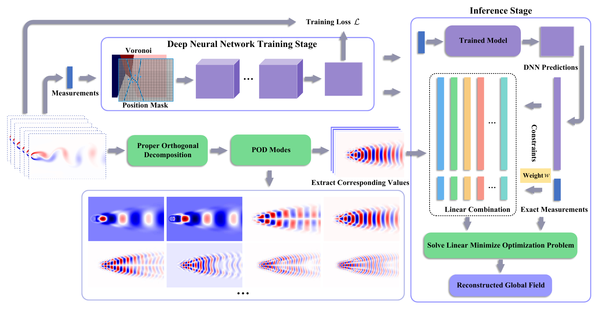
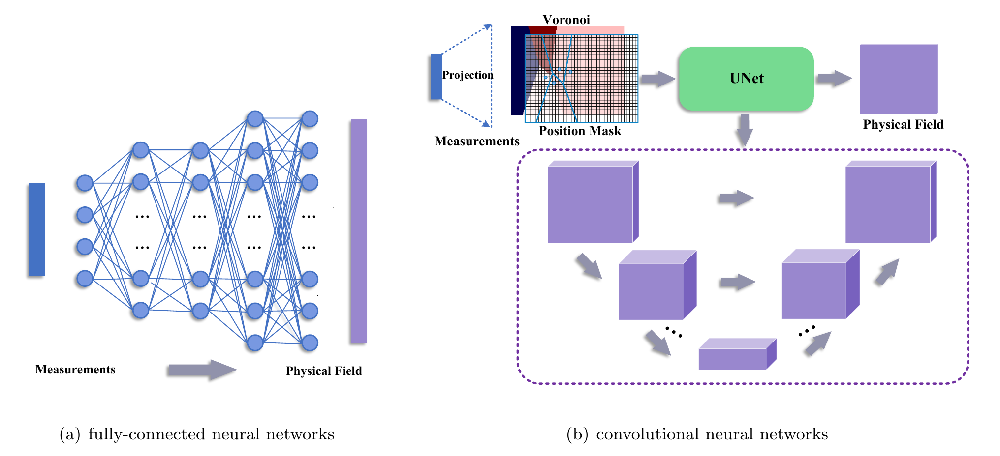
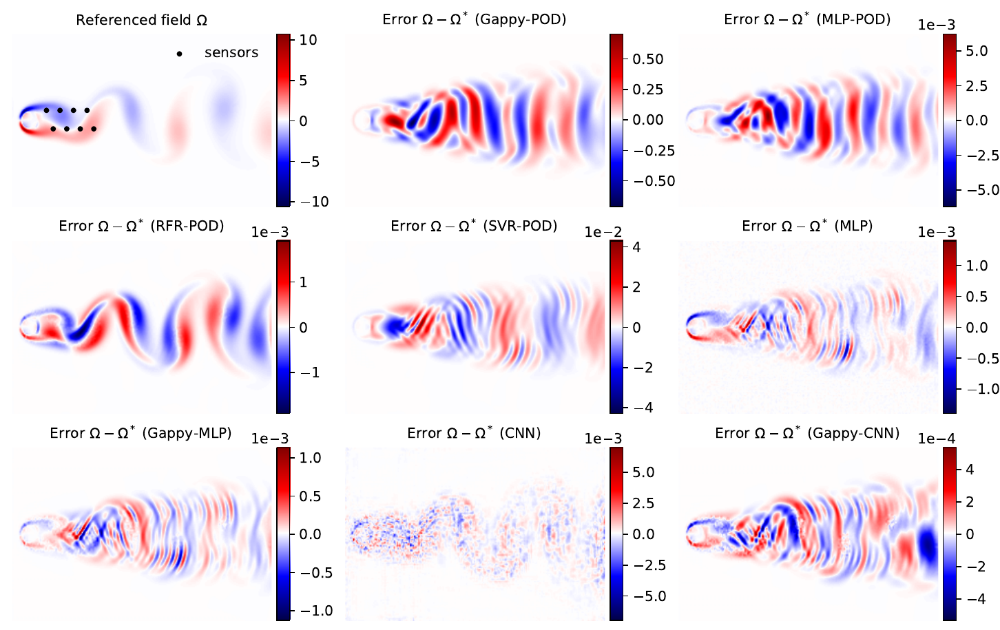
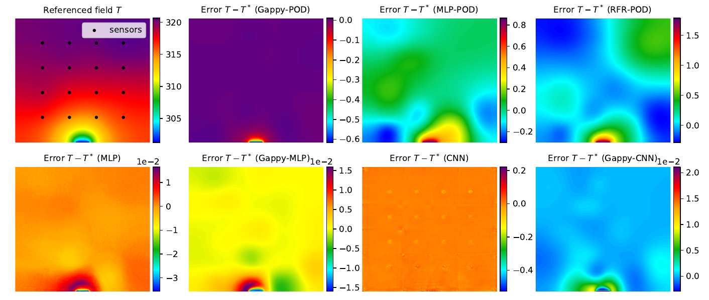

# A hybrid method based on proper orthogonal decomposition and deep neural networks for flow and heat field reconstruction
This is the implementation of ‘’A hybrid method based on proper orthogonal decomposition and deep neural networks for flow and heat field reconstruction“

- Illustration of the proposed hybrid method based on POD and DNN for global field reconstruction from sparse measurements.





- Visualization for the results on flow past circular cylinder. The first panel presents the references vortex field  and locations of sensors. The other panels show the point-wise error for existing methods and our method.



- Visualization for the results on 2D steady-state heat conduction. The first panel presents the reference temperature field and locations of sensors. The other panels show the point-wise error for existing methods and our method.



# Usage

## Environment

```shell
torch=1.12.1+cu113
torchvision=0.13.1+cu113
tensorboard
scipy
h5py
```

## Data Preparation

Please download the dataset to your local drive, and modify the path of dataset in the $dataset.py$.

- [2D Cylinder Wake](https://nudteducn-my.sharepoint.com/:f:/g/personal/zhaoxiaoyu13_nudt_edu_cn/EsMGFk8x6CRMqastVlVu1zcBORqDbFhOupb1AyjSzW3uoA?e=62iInH).
- [2D Steady-state Heat Conduction](https://nudteducn-my.sharepoint.com/:f:/g/personal/zhaoxiaoyu13_nudt_edu_cn/ElHePUBS_gpIjr240jcrdZ4BhMKsA3DBeYWLS6Roq_52TA?e=RZKOh5).
- [compressible flows over aerofoil](https://nudteducn-my.sharepoint.com/:f:/g/personal/zhaoxiaoyu13_nudt_edu_cn/EmONKDe3xThLtPKQpmPY74EBGeZWgN2w4QaokhLlB1-paA?e=H4gasl)
- [incompressible_flows_over_aerofoil](https://nudteducn-my.sharepoint.com/:f:/g/personal/zhaoxiaoyu13_nudt_edu_cn/EvNgszZYY5RDn6zgGlmHqHMBlKbkzoKK42qMUd6SSzMxuQ?e=0GFjdP)

# Citation

If you find our codes or models useful, please consider to give us a star or cite with:

```

```

